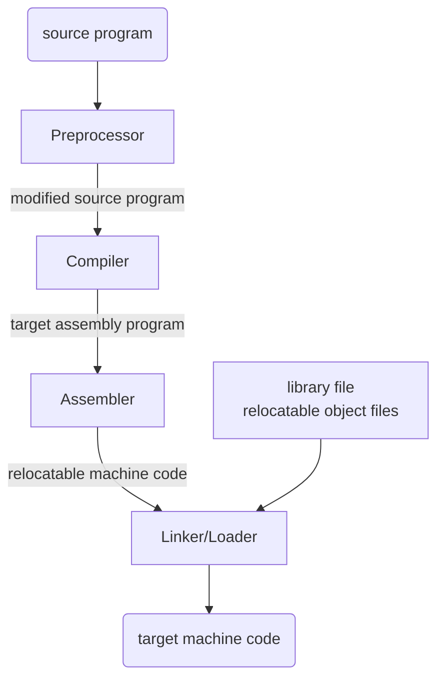
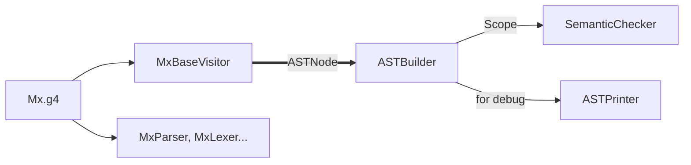
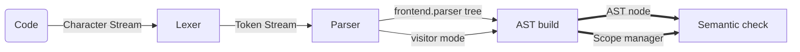

# Mx-Compiler
---

- [x] Current Progress: Semantic Check

:computer: [课程地址](https://github.com/ACMClassCourses/Compiler-Design-Implementation)

<div align=center>  </div> 

- A language-processing system:



### Configuration

[IDEA Java environment](https://blog.csdn.net/brytlevson/article/details/106461319?spm=1001.2014.3001.5506)

[Set up Antlr4 on Win10](https://github.com/antlr/antlr4/blob/master/doc/getting-started.md)

### Relevant commands

```
   antlr4 <filename>.g4 -visitor
   javac *.java
   grun <filename> <rulename> -tokens
   
   diff <file1> <file2> -qZB # regardless of space endl
```

java编译:

```
javac <filename>.java 
javac -encoding UTF-8 <filename>.java # support Chinese comment 
java <filename>
```
`assert` 模式开启需要 IDEA 在 run configuration 中的 VM option 加上`-ea`


## Semantic Design

- File structure:



- Procedure description:


### Reference

1. [Yx written by Antlr4](https://github.com/ZYHowell/Yx/tree/1c1a74e8e636cf64d2e6f73975cfb2cf50f69cca)
2. 虎/龙书
