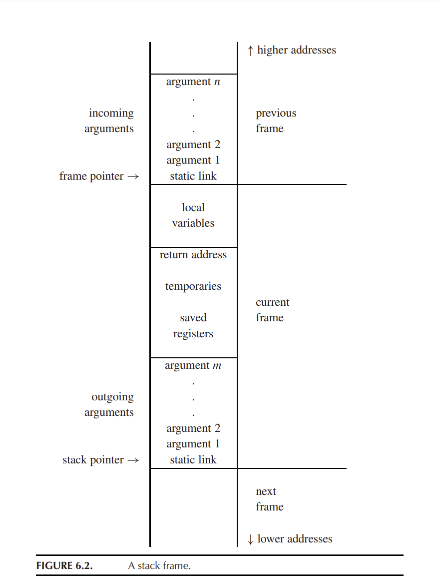

- ASM Module

  - Physical registers (32 reg)

  - ASM Function

    - parameters (a0-7: reg | 8+: memory)

    - Blocks
      - Instructions
    - callee register

Virtual Register: actually is memory.

Tiger Book P142

### The Stack Pointer (sp)

​	We treat the stack as a big array, with a special register – the stack pointer – that points at some location. All locations beyond the stack pointer are considered to be garbage, and all locations **before** the stack pointer are considered to be allocated. The stack usually **grows only at the entry to a function**, by an increment large enough to hold all the local variables for that function, and, just before the exit from the function, shrinks by the same amount.

- For historical reasons, run-time stacks usually start at a high memory address and grow toward smaller addresses.

### The Frame Pointer (fp)

 	Suppose a function $g(. . .)$ calls the function $f (a_1,..., a_n)$. We say g is the $caller$ and f is the $callee$. On entry to $f$ , the stack pointer points to the first argument that $g$ passes to $f$ . On entry, $f$ allocates a frame by simply subtracting the frame size from the stack pointer $SP$.

- After allocation (sub sp), the old sp now becomes the current fp (frame pointer), and the old fp will be store in memory.
- When $f$ exits, just copies fp back to sp and fetches back the saved fp.

### Parameter Passing

​	 Studies of actual programs have shown that very few functions have more than four arguments, and almost none have more than six.

​	Therefore, parameter-passing conventions for modern machines specify that the first $k$ arguments (for $k = 4$ or $k = 6$, typically) of a function are passed in registers $r_p, ...,r_{p+k−1}$, and the rest of the arguments are passed in memory.

### Return Address

​	When function $g$ calls function $f$ , eventually $f$ must return. It needs to know where to go back to. If the call instruction within g is at address a, then (usually) the right place to return to is a + 1, the next instruction in $g$. This is called the return address.