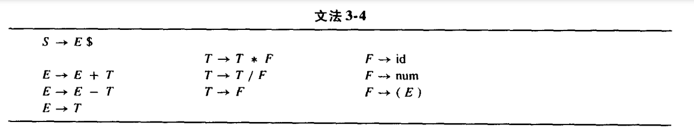
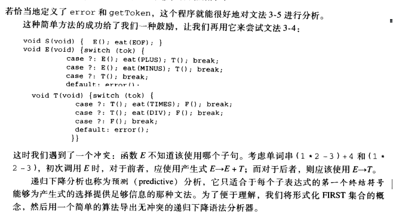
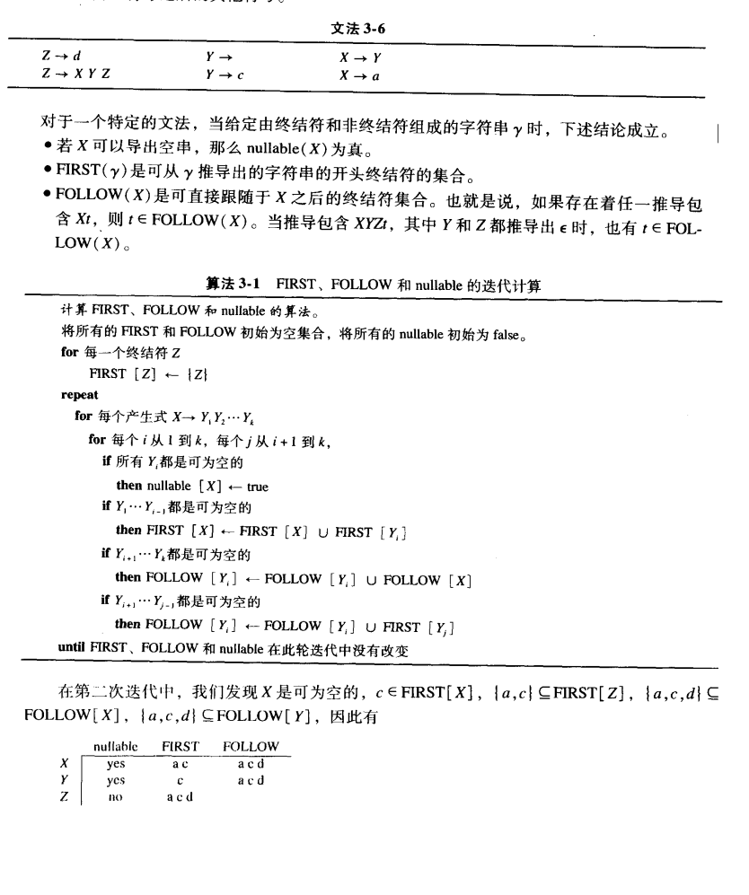

From [Modern Compiler Implementation](https://www.cs.princeton.edu/~appel/modern/)

- `production`: 产生式, symbol → symbol_1 symbol_2 ... symbol_n
- `terminal`: 终结符, 即没有出现在任何一个production左边
- `nonterminal`: 非终结符

CFG: i.e., context-free grammar means the left handside of the production only has one nonterminal node.

> e.g.  S → aSb
>
> ​	S → ab

## LL Parsing

对于一个production $X\rightarrow \gamma$: 若 $T\in \text{FIRST}(\gamma)$ 则, 在表格的 $X$ 行 $T$ 列中加入 $X\rightarrow \gamma$ , 若  $\gamma$ is nullable, 则对每个 $T\in \text{FOLLOW}(X)$ 也填入该production. 

不难发现table中表示的就是每一个production $X$ 能否derive出某个terminal character (i.e. {a, c, d} in the example)

若表格中某一格出现两个production, 则表示该文法不能用LL(1)来识别, 否则会产生**二义性**.

- 若一个文法的预测分析表不含多重定义的项, 则称其为LL(1)语法, 可以~~显然~~利用`FIRST`集合来判断下一步的走向

- ANTLR是LL(*)分析的, 即可以自动根据情境, 来采用LL(1), LL(2), ... ,LL(k)来进行语法分析

  Terence Parr，ANTLR 的作者，开发了 LL'(k) parser，把复杂度从大家认为的 $O(|T| ^ k)$ 降低到 $O(|T| \cdot k)$

## LR Parsing

- LR(k) stands for Left-to-right parse, Rightmost-derivation, k-token lookahead.

   The weakness of LL(k) parsing techniques is that they must predict which production to use, having seen only the first k tokens of the right-hand side. A more powerful technique, LR(k) parsing, is able to postpone the decision
   until it has seen input tokens corresponding to the entire right-hand side of the production in question (and k more input tokens beyond).

