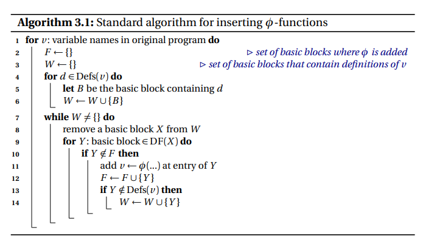
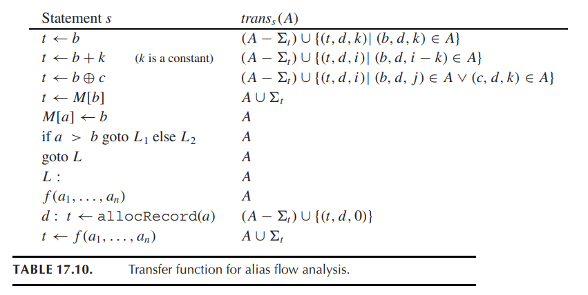

### Dominator Tree

[ref](https://blog.csdn.net/dashuniuniu/article/details/52224882)

- use-def chain: a Use-Definition Chain consists of a use, U, of a variable, and all the definitions, D, of that variable that can reach that use without any other intervening definitions.
- def-use chain: ...


Reduce phi redundancy.


- idom(n):
  - idom(n) is not the same node as n
  - idom(n) dominates n
  - idom(n) does not dominate any other dominator of n.


- Y is in the dominance frontier of X $\iff$ there exists a path from X to Exit through Y such that Y is the **first** node **not** strictly dominated by X.

  ***Algorithm***


:question: Why in the loop we only jump along the Dominator Tree? `runner = doms[runner]`

> Because otherwise, it will obey the "**first node**" restriction in the definition of dominance frontier.


### Mem2Reg

SSA construction is a two-phase process: placement of $φ$-functions, followed by renaming. 

The goal of the first phase is to generate code that fulfills the single reaching-definition property.

- A definition D of variable v **reaches** a point p in the CFG if there exists a path from D to p that does not pass through another definition of v.
- Let n1 and n2 be distinct basic blocks in a CFG. A basic block n3, which may or may not be distinct from n1 or n2, is a join node of n1 and n2 if there exist at least two non-empty paths, i.e., paths containing at least one CFG edge, from n1 to n3 and from n2 to n3, respectively, such that n3 is the only basic block that occurs on both of the paths.

#### Insert of Phi



#### Variable renaming


### Reducibility of CFG

A reducible CFG is one with edges that can be partitioned into two disjoint sets: forward edges, and back edges:

- Forward edges form a [directed acyclic graph](https://en.wikipedia.org/wiki/Directed_acyclic_graph) with all nodes reachable from the entry node.
- For all back edges (A, B), node B [dominates](https://en.wikipedia.org/wiki/Dominator_(graph_theory)) node A.


### Alias Analysis

similar with Pointer analysis, the goal is to get all names that may point to the same memory locations.

The dataflow algorithm manipulates sets of tuples of the form $(t, d, k)$ where $t$ is a variable and $d, k$ is the alias class of all instances of the $kth$ field of a record allocated at location $d$. The set $in[s]$ contains $(t, d, k)$ if
$t − k$ might point to a record of alias class $d$ at the beginning of statement $s$.




### Loop

The natural loop of a back edge $n → h$, where $h$ dominates $n$, is the set of nodes $x$ such that h dominates $x$ and there is a path from $x$ to $n$ not containing $h$. The header of this loop will be $h$.

#### Loop invariant computations

Hoisting Conditions:

For a loop-invariant definition $d: t\leftarrow a \oplus b$

we can hoist d into the loop’s pre-header if

1. $d$ ’s block dominate s all loop exits at which $t$ is live-out
2. there is only one definition of $t$ in the loop
3. $t$ is not live-out of the pre-header

pitfall cases can be referred in the *Tiger Book*.


##### Dilemma

```cpp
int x;
for (x = 0; x < 10; x = x + 1) {
  a = b + c;
}
```

- line 3 can be pulled out of the loop, however, the loop can just be eliminated immediately incase x will be used latter. Thus, my current optimization result is not that obvious.