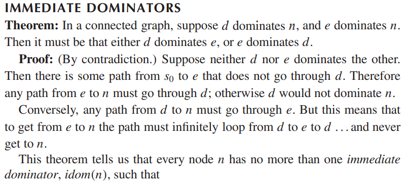

### Dominator Tree

[ref](https://blog.csdn.net/dashuniuniu/article/details/52224882)

- use-def chain: a Use-Definition Chain consists of a use, U, of a variable, and all the definitions, D, of that variable that can reach that use without any other intervening definitions.
- def-use chain: 

Reduce phi redundancy.

- idom(n):
  - idom(n) is not the same node as n
  - idom(n) dominates n
  - idom(n) does not dominate any other dominator of n.

### Reducibility of CFG

A reducible CFG is one with edges that can be partitioned into two disjoint sets: forward edges, and back edges:

- Forward edges form a [directed acyclic graph](https://en.wikipedia.org/wiki/Directed_acyclic_graph) with all nodes reachable from the entry node.
- For all back edges (A, B), node B [dominates](https://en.wikipedia.org/wiki/Dominator_(graph_theory)) node A.

### Loop

The natural loop of a back edge $n → h$, where $h$ dominates $n$, is the set of nodes $x$ such that h dominates $x$ and there is a path from $x$ to $n$ not containing $h$. The header of this loop will be $h$.

#### loop invariant computations

