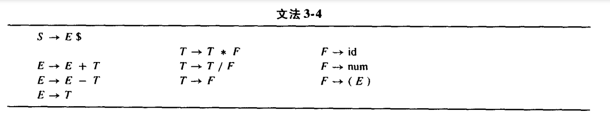
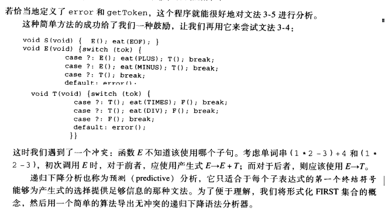
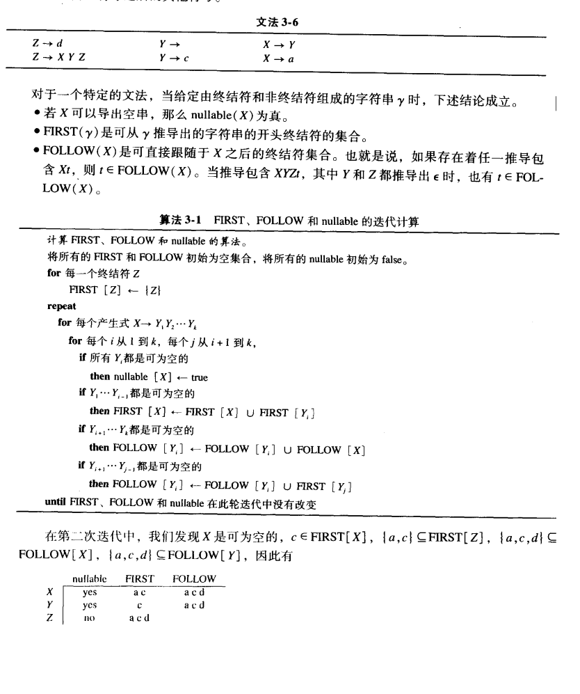

From [Modern Compiler Implementation](https://www.cs.princeton.edu/~appel/modern/)

- `production`: 产生式, symbol → symbol symbol ... symbol
- `terminal`: 终结符, 即没有出现在任何一个production左边
- `nonterminal`: 非终结符

若 $T\in \text{FIRST}(\phi)$ 则, 在表格的 $X$ 行 $T$ 列中加入 $X\rightarrow \phi$ , 若 $\phi$为可空的, 则对每个 $T\in \text{FIRST}(X)$ 也填入该产生式.

若表格中某一格出现两个production, 则表示该文法不能用LL(1)来识别, 否则会有**二义性**.

- 若一个文法的预测分析表不含多重定义的项, 则称其为LL(1)语法, 可以~~显然~~利用`FIRST`集合来判断下一步的走向
- ANTLR是LL(*)分析的, 即可以自动根据情境, 来采用LL(1), LL(2), ... ,LL(k)来进行语法分析

LR()分析: 见虎书p40+/-