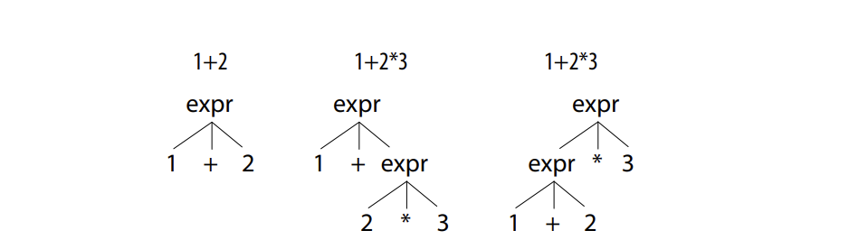

## ANTLR

---

LexerRule无论写在哪都会被放在ParserRule之后.

### Listener VS Visitor

- listener监听器: enter()和exit()都有对应函数, 无需考虑父子节点关系 (入戳和出戳)
- visitor: 需考虑父子节点关系

### Regular expression

- 非贪婪匹配: e.g. 	".*?"

- "~"符号: 

  ```java
  STUFF : ~[\t\r\n]+ ; // match any chars except tab, newline
  ```

- ab和[ab]的区别: 前者是ab这一个整体, 后者是字符a或者字符b

### Dealing with Precedence, Left Recursion, and Associativity

`1+2*3 ` can be interpreted by 2 different ways:



​	In order to deal with the precedence, ANTLR4 resolves ambiguities in favor of the **alternative given first**, implicitly allowing us to specify operator precedence. Rule expr has the multiplication alternative before the addition alternative, so ANTLR resolves the
operator ambiguity for `1+2*3` in favor of the multiplication.

- for `1+2+3` or `1*2*3`, it's left associative. However, some operators like exponentiation group right to left

  e.g. 2^3^4 $\equiv$ 2^(3^4)

  - Thus... we need to write 

  ```java
  expr : expr '^'<assoc=right> expr
  ```


### Label all alternatives

Personally, I think it's only for the convenience of recognizing a parser  Tree...

否则, parser Tree的label只会跟一个数字(如3), 表示它匹配上的是第(如3)几个alternatives.

### EOF and Start Rules

- A *start rule* is the rule engaged first by the parser

  ```
  s : ID
  | ID '+'
  | ID '+' INT
  ;
  ```

  When you input a+b, it matches $2^{nd}$ rule and only **ignores** b token.

  This feature is useful when an IDE tries to parse a method, so that it can ignore whatever comes next.

  > *****注: 这里ID '+' 的写法完全等于 ID Add (~~应该~~系统会自动识别)

- However...

  ```
  config : element*; // can "match" even with invalid input.
  ```

  **Invalid input** would cause config to **return immediately** without matching any input and without reporting an error. Here’s the proper specification:

  ```
  file : element* EOF; // don't stop early. must match all input
  ```


### Error Listener

异常处理, 见英文版*The Definitive ANTLR 4 Reference* P154

### Matching String Literals

```
String	:	'"' .*? '"';
```

This is no good, because when you type in a string, say `"abc\""` 

Due to the **Nongreedy Rules**, it will only math `"abc\"` and leave the last double quote  behind.

Thus, we need to use this to tell ANTLR to recognize this special case:

```
STRING: '"' (ESC|.)*? '"' ;
fragment
ESC : '\\"' | '\\\\' ; // 2-char sequences \" and \\
```

